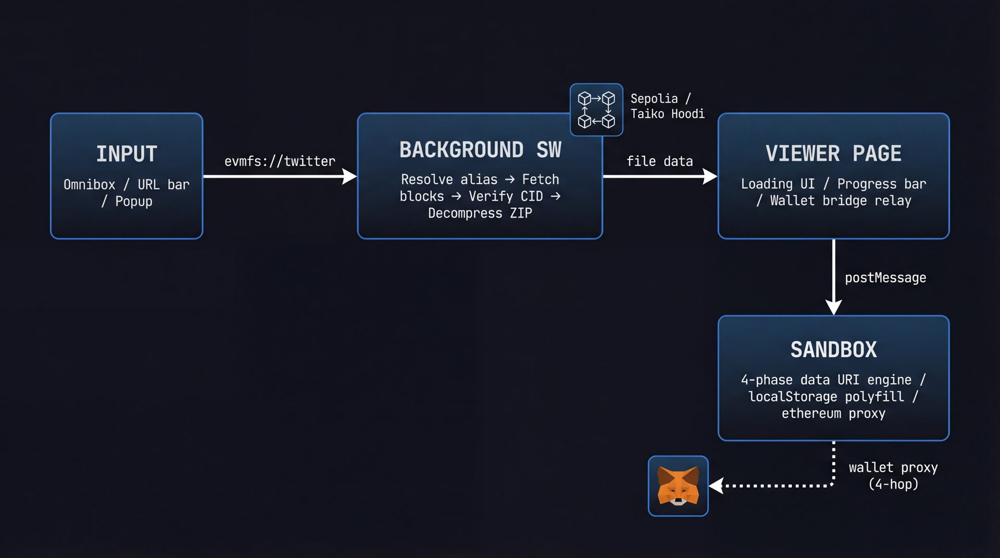

# EVMFS Browser Extension

[](https://github.com/walletcast/evmfs-browser-extension/actions/workflows/ci.yml)
[](https://www.typescriptlang.org/)
[](https://developer.chrome.com/docs/extensions/mv3/)
[](LICENSE)
[](#zero-dependencies)

Chrome extension that resolves `evmfs://` URLs and `*.evmfs` / `*.evm` TLDs directly from on-chain EVM storage. **Zero external runtime dependencies.**

## Install

### From Release (recommended)

1. Download `evmfs-browser-plugin.zip` from [Releases](https://github.com/walletcast/evmfs-browser-extension/releases)
2. Unzip to a folder
3. `chrome://extensions` &rarr; Enable **Developer Mode** &rarr; **Load Unpacked** &rarr; select the folder

### From Source

```bash
git clone https://github.com/walletcast/evmfs-browser-extension.git
cd evmfs-browser-extension
npm install
npm run build
# Load dist/ as unpacked extension
```

## Try It

After installing, try these in Chrome's address bar:

| Input | What loads |
|-------|-----------|
| `evmfs twitter` | Web3 Twitter clone (type in omnibox) |
| `evmfs dgn` | DGN dApp |
| `http://twitter.evmfs` | Same site via fake TLD |
| `http://dgn.evmfs` | DGN via fake TLD |
| `http://twitter.evm` | `.evm` TLD also works |

Or paste a raw CID:
```
evmfs 0x6ad301484330...
```

## Architecture



**Background service worker** &mdash; URL parsing, multi-chain on-chain resolution, block-by-block fetching, SHA-256 CID verification, DEFLATE decompression, IndexedDB caching.

**Viewer page** &mdash; Loading progress UI, delegates rendering to the sandbox, bridges wallet requests.

**Sandbox page** &mdash; Runs with relaxed CSP. 4-phase data-URI inlining engine renders full Vite/React SPAs: binary assets &rarr; CSS `url()` rewrite &rarr; JS import rewrite (topological sort + circular dep detection) &rarr; HTML ref rewrite with entry script inlining.

### Wallet Proxy (MetaMask Bridge)

Sites can use `window.ethereum` inside the sandbox. Requests are proxied through a 4-hop chain:

```
Sandbox (window.ethereum.request)
  --> postMessage --> Viewer
    --> chrome.runtime --> Background SW
      --> chrome.scripting.executeScript(MAIN world) --> MetaMask in any web tab
```

Events (`accountsChanged`, `chainChanged`) flow back via polling.

## Supported Chains

| Chain | ID | Status |
|-------|------|--------|
| Sepolia | 11155111 | Active |
| Taiko Hoodi | 167013 | Active |

## Zero Dependencies

The entire extension is pure TypeScript with **zero npm runtime dependencies**:

- **DEFLATE decompressor** &mdash; RFC 1951 implementation (~300 lines)
- **ABI encoder/decoder** &mdash; Hardcoded selectors for 4 contract functions
- **SHA-256 verification** &mdash; Uses `crypto.subtle` (built-in)
- **ZIP parser** &mdash; Reads central directory, supports STORE + DEFLATE
- **JSON-RPC** &mdash; Raw `fetch()` calls

Dev dependencies are only `typescript`, `@types/chrome`, and `vitest`.

## Development

```bash
npm install
npm run typecheck   # Type check
npm test            # Run tests
npm run test:coverage  # Tests + coverage report
npm run build       # Build to dist/
```

### Project Structure

```
src/
  background/
    main.ts        # Service worker: omnibox, URL intercept, wallet proxy
    chains.ts      # Chain configs (Sepolia, Taiko Hoodi)
    rpc.ts         # Raw JSON-RPC eth_call
    abi.ts         # ABI encode/decode (4 selectors)
    evmfs.ts       # Block-by-block file fetching
    registry.ts    # Name -> CID resolution
    cache.ts       # IndexedDB caching
    zip.ts         # ZIP parser + DEFLATE inflater
    mime.ts        # Extension -> MIME mapping
    crypto.ts      # Rolling SHA-256 CID verification
  sandbox/
    sandbox.ts     # Site rendering engine (data URI inlining)
  viewer/
    viewer.ts      # Loader UI + sandbox/wallet bridge
  popup/
    popup.ts       # Extension popup
```

## License

[MIT](LICENSE)
